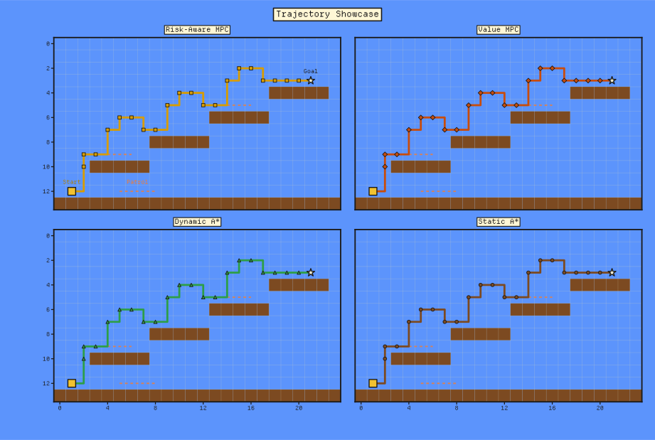
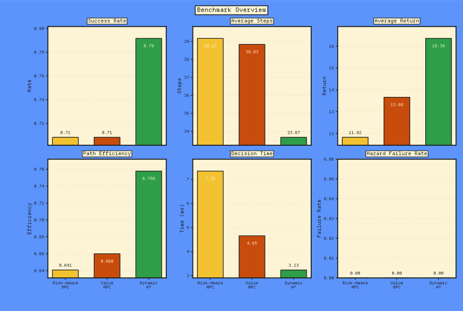

# Platformer Lab

> A compact CLI-first retro AI showcase for a handcrafted 2D platformer.
>
> Pure-NumPy `Value MPC`, A* baselines, risk-aware planning, and curated report artifacts assembled into a single self-contained showcase workflow.



## At A Glance

- A single CLI pass trains controllers, evaluates baselines, and redraws committed showcase figures from the same checkout.
- The learned MPC controllers stay in pure `NumPy`, without a heavyweight deep learning stack.
- Handcrafted 24x14 platformer levels include mirrored variants, patrol enemies, and shared evaluation protocols.
- Benchmarks compare `Dynamic A*`, `Static A*`, `Value MPC`, and `Risk-Aware Value MPC` side by side.
- Committed checkpoints, metrics, and SVG figures live under [outputs](./outputs) for immediate inspection.

## Quickstart

The runtime stack is intentionally small: just `NumPy` and `Matplotlib` on Python `3.10+`.

```bash
python -m venv .venv
source .venv/bin/activate
pip install -e .
platformer-lab
```

After `pip install -e .`, both `platformer-lab` and `python -m platformer_lab` run the same workflow from this checkout.
If you want to run directly from the repository without installing first, use `PYTHONPATH=src python -m platformer_lab`.

A full `platformer-lab` rerun can take a while because the `seed sweep` study retrains the controller multiple times. To inspect the committed figures and metrics first, start with `platformer-lab --plots-only`.

Common commands include the following:

```bash
# Run the full training, evaluation, and plotting pipeline
platformer-lab

# Redraw all figures from cached artifacts only
platformer-lab --plots-only

# Redraw one specific plot
platformer-lab --plot trajectory_showcase --force-redraw

# Resume training from an existing checkpoint
platformer-lab --resume-model outputs/checkpoints/primary_value_mpc_checkpoint.npz
```

When run from the repository, generated artifacts default to [outputs](./outputs). Set `PLATFORMER_LAB_OUTPUT_DIR=/path/to/outputs` to redirect generated files elsewhere.

## Artifact Guide

- Start with [outputs/plots](./outputs/plots) for the fast visual pass.
- Use [outputs/metrics](./outputs/metrics) for the benchmark tables and study summaries behind the figures.
- Inspect [outputs/checkpoints](./outputs/checkpoints) if you want the committed controller snapshots without retraining.

## Showcase Flow

The installed `platformer-lab` CLI is the primary interface; after `pip install -e .`, `python -m platformer_lab` is equivalent. It runs:

1. Training for the primary `Value MPC` controller, plus export of a risk-aware clone.
2. Benchmark evaluation across `Static A*`, `Dynamic A*`, `Value MPC`, and `Risk-Aware Value MPC`.
3. Supplementary studies: `seed sweep`, `sensitivity study`, `ablation study`, `noise robustness`, and `holdout generalization`.
4. Figure generation and representative trajectory visualization under [outputs](./outputs).

## Snapshot

The primary benchmark summary comes from [outputs/metrics/primary_benchmark_summary_metrics.csv](./outputs/metrics/primary_benchmark_summary_metrics.csv):

| Controller           | Success Rate | Avg Steps | Hazard Failures | Decision Time |
|----------------------|--------------|-----------|-----------------|---------------|
| Dynamic A*           | 79.2%        | 33.67     | 0.000           | 3.23 ms       |
| Risk-Aware Value MPC | 70.8%        | 39.17     | 0.000           | 7.35 ms       |
| Value MPC            | 70.8%        | 38.83     | 0.000           | 4.65 ms       |
| Static A*            | 41.7%        | 29.17     | 0.375           | 0.36 ms       |

A few quick reads from the artifacts:

- On the primary benchmark, `Dynamic A*` leads at `79.2%` success, while `Value MPC` and `Risk-Aware Value MPC` both land at `70.8%`; the risk-aware variant takes longer per decision.
- In the `seed sweep`, `Risk-Aware Value MPC` averages `86.7%` success versus `85.0%` for `Value MPC`, so the two learned controllers remain close across training seeds.
- In `holdout generalization` on `tower|overhang`, `Risk-Aware Value MPC` improves success from `56.2%` to `75.0%` relative to `Value MPC`, matching `Dynamic A*` on the held-out split.
- Under `0.16` action noise, `Value MPC` reaches `76.0%` success, slightly ahead of `Dynamic A*` at `74.0%` and clearly above the risk-aware variant at `63.5%`.



## Positioning

This repository is intentionally positioned as a compact, CLI-first retro AI showcase rather than a reusable platformer framework or a heavyweight research toolkit.

- The repository favors a single end-to-end showcase workflow over a general-purpose toolbox.
- Controllers stay in pure `NumPy`, and the figures lean into an 8-bit / arcade palette so the presentation matches the platformer setting.
- The figures keep a fixed `Departure Mono` look across machines.
- `outputs/plots`, `outputs/metrics`, and checkpoints are the curated showcase assets; `outputs/cache` contains auxiliary redraw state and may include machine-local Matplotlib or font caches.

## License

- Code: MIT. See [LICENSE](LICENSE).
- Font: `Departure Mono` (OFL 1.1). Source: [rektdeckard/departure-mono](https://github.com/rektdeckard/departure-mono). See [OFL.txt](./src/platformer_lab/assets/fonts/OFL.txt).
